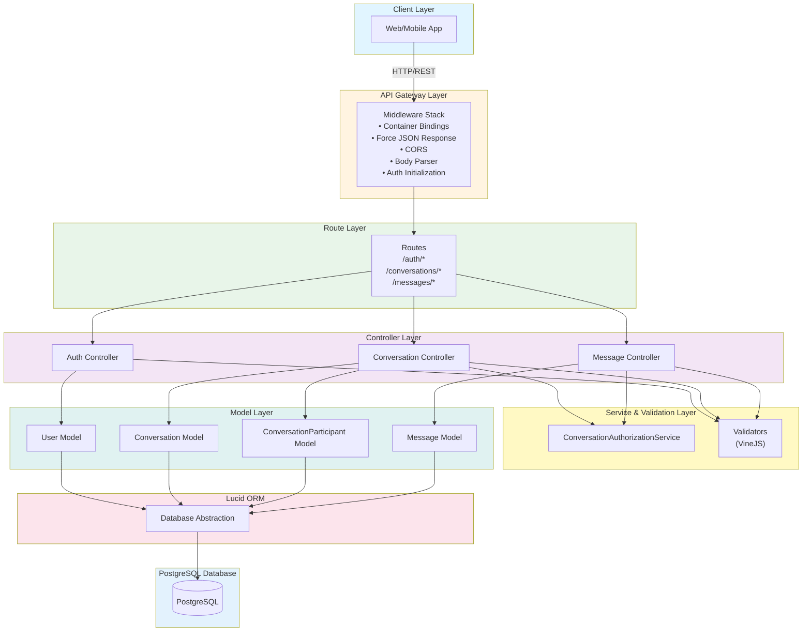
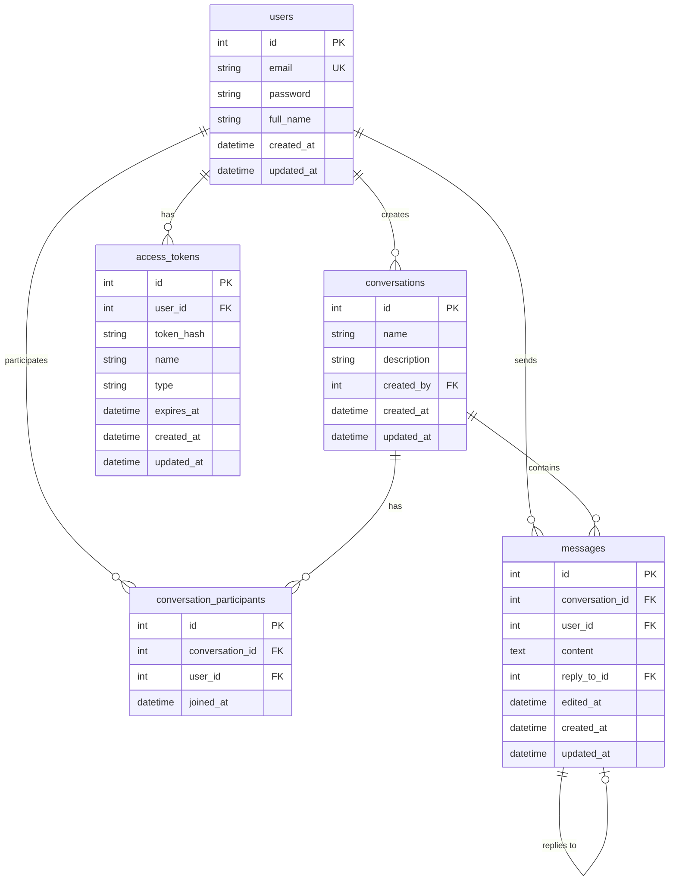

# AdonisJS Chat Backend

A production-grade backend service for a multi-room chat application built with AdonisJS and TypeScript. This RESTful API provides secure authentication, conversation management, and real-time messaging capabilities with support for message replies.

## 📋 Table of Contents

- [Project Overview](#project-overview)
- [Features](#features)
- [Tech Stack](#tech-stack)
- [Architecture](#architecture)
- [Project Structure](#project-structure)
- [Dependencies](#dependencies)
- [Setup Instructions](#setup-instructions)
- [API Endpoints](#api-endpoints)

## 🎯 Project Overview

This is a full-featured chat backend service that enables users to:
- Register and authenticate securely
- Create and manage multi-participant conversations
- Send, edit, and delete messages within conversations
- Reply to specific messages (WhatsApp-style threading)
- Access conversations and messages with proper authorization

The application follows RESTful API principles, implements JWT-based authentication, and enforces strict authorization rules to ensure data security and privacy.

## ✨ Features

### Authentication & Authorization
- **User Registration**: Secure user registration with email and password
- **User Login**: JWT-based authentication with access tokens
- **Token Refresh**: Refresh access tokens without re-authentication
- **Guest Access**: Generate temporary guest tokens for unauthenticated users
- **Secure Password Hashing**: Uses Scrypt for password hashing
- **Token Management**: Secure token creation, refresh, and revocation

### Conversations
- **CRUD Operations**: Create, read, update, and delete conversations
- **Multi-Participant Support**: Add and remove participants from conversations
- **Authorization**: Only participants can access or modify conversations
- **Creator Privileges**: Only conversation creators can update or delete conversations
- **Participant Management**: Add/remove participants with proper validation

### Messages
- **CRUD Operations**: Create, read, update, and delete messages
- **Message Replies**: Reply to specific messages (threading support)
- **Ownership Control**: Users can only edit/delete their own messages
- **Pagination**: Paginated message retrieval for better performance
- **Edit Tracking**: Tracks when messages are edited
- **Authorization**: Only conversation participants can read/send messages

### Security & Best Practices
- **JWT Authentication Middleware**: Protects all conversation and message routes
- **Request Validation**: Input validation using VineJS validators
- **Authorization Checks**: Service-layer authorization for fine-grained access control
- **Proper HTTP Status Codes**: RESTful status code usage
- **Error Handling**: Comprehensive error handling with proper error messages
- **CORS Support**: Cross-origin resource sharing configuration

## 🛠 Tech Stack

### Core Framework
- **AdonisJS 6.x**: Modern Node.js framework with TypeScript support
- **TypeScript**: Type-safe development
- **Node.js**: Runtime environment

### Database
- **PostgreSQL**: Primary database (recommended)
- **Lucid ORM**: AdonisJS's built-in ORM for database operations
- **Database Migrations**: Version-controlled database schema management

### Authentication
- **@adonisjs/auth**: JWT-based authentication with access tokens
- **Scrypt**: Secure password hashing algorithm

### Validation
- **VineJS**: Schema-based request validation

### Additional Libraries
- **Luxon**: Date and time manipulation
- **CORS**: Cross-origin resource sharing support
- **Pino**: Structured logging

## 🏗 Architecture

### System Architecture



### Data Flow Summary

1. **Request Flow**:
   - Client sends HTTP request → Middleware stack processes → Route matches → Controller handles → Service validates authorization → Model queries database → Response returned

2. **Authentication Flow**:
   - User registers/logs in → Credentials validated → JWT token generated → Token stored in database → Token returned to client → Client includes token in subsequent requests

3. **Authorization Flow**:
   - Protected route accessed → Auth middleware validates token → User extracted from token → Authorization service checks permissions → Access granted/denied

### Database Schema



## 📁 Project Structure

```
AdonisJS_Chat_Backend/
├── app/
│   ├── controllers/          # Request handlers
│   │   ├── auth_controller.ts
│   │   ├── conversation_controller.ts
│   │   └── message_controller.ts
│   ├── exceptions/           # Error handling
│   │   └── handler.ts
│   ├── middleware/           # HTTP middleware
│   │   ├── auth_middleware.ts
│   │   ├── container_bindings_middleware.ts
│   │   └── force_json_response_middleware.ts
│   ├── models/               # Database models (Lucid ORM)
│   │   ├── user.ts
│   │   ├── conversation.ts
│   │   ├── conversation_participant.ts
│   │   └── message.ts
│   ├── services/             # Business logic services
│   │   └── conversation_authorization_service.ts
│   └── validators/           # Request validation schemas
│       ├── auth_validator.ts
│       ├── conversation_validator.ts
│       └── message_validator.ts
├── config/                   # Configuration files
│   ├── app.ts
│   ├── auth.ts
│   ├── bodyparser.ts
│   ├── cors.ts
│   ├── database.ts
│   ├── hash.ts
│   └── logger.ts
├── database/
│   └── migrations/           # Database migrations
│       ├── create_users_table.ts
│       ├── create_access_tokens_table.ts
│       ├── create_conversations_table.ts
│       ├── create_conversation_participants_table.ts
│       └── create_messages_table.ts
├── start/
│   ├── env.ts                # Environment variable validation
│   ├── kernel.ts             # Middleware registration
│   └── routes.ts            # Route definitions
├── bin/
│   ├── console.ts            # CLI entry point
│   └── server.ts             # Server entry point
├── tests/                    # Test files
│   └── bootstrap.ts
├── ace.js                    # Ace CLI configuration
├── adonisrc.ts               # AdonisJS configuration
├── package.json              # Dependencies and scripts
├── tsconfig.json             # TypeScript configuration
└── README.md                 # This file
```

### Directory Responsibilities

- **`app/controllers/`**: Handle HTTP requests, validate input, call services, return responses
- **`app/models/`**: Define database models with relationships using Lucid ORM
- **`app/services/`**: Business logic and authorization checks
- **`app/validators/`**: Request validation schemas using VineJS
- **`app/middleware/`**: HTTP middleware for authentication, CORS, etc.
- **`database/migrations/`**: Database schema version control
- **`config/`**: Application configuration (database, auth, CORS, etc.)
- **`start/`**: Application bootstrap files (routes, middleware, env)

## 📦 Dependencies

### Production Dependencies

| Package | Version | Purpose |
|---------|---------|---------|
| `@adonisjs/core` | ^6.18.0 | Core AdonisJS framework |
| `@adonisjs/auth` | ^9.4.0 | Authentication and authorization |
| `@adonisjs/lucid` | ^21.6.1 | Database ORM |
| `@adonisjs/cors` | ^2.2.1 | CORS support |
| `@vinejs/vine` | ^3.0.1 | Request validation |
| `pg` | ^8.16.3 | PostgreSQL driver |
| `luxon` | ^3.7.2 | Date/time manipulation |
| `reflect-metadata` | ^0.2.2 | TypeScript metadata support |

### Development Dependencies

| Package | Version | Purpose |
|---------|---------|---------|
| `typescript` | ~5.8 | TypeScript compiler |
| `@adonisjs/assembler` | ^7.8.2 | Build tool |
| `@adonisjs/eslint-config` | ^2.0.0 | ESLint configuration |
| `@adonisjs/prettier-config` | ^1.4.4 | Prettier configuration |
| `@japa/*` | Various | Testing framework |
| `eslint` | ^9.26.0 | Linting |
| `prettier` | ^3.5.3 | Code formatting |

## 🚀 Setup Instructions

### Prerequisites

- **Node.js**: v18.x or higher
- **PostgreSQL**: 12.x or higher
- **npm** or **yarn**: Package manager

### Step 1: Clone the Repository

```bash
git clone <repository-url>
cd AdonisJS_Chat_Backend
```

### Step 2: Install Dependencies

```bash
npm install
```

### Step 3: Environment Variables

Create a `.env` file in the root directory:

```bash
cp .env.example .env  # If you have an example file
```

Configure the following environment variables in `.env`:

```env
# Application
NODE_ENV=development
PORT=3333
HOST=localhost
APP_KEY=your-32-character-secret-key-here
LOG_LEVEL=info

# Database
DB_HOST=127.0.0.1
DB_PORT=5432
DB_USER=your_db_user
DB_PASSWORD=your_db_password
DB_DATABASE=adonis_chat_db
```

#### Generating APP_KEY

Generate a secure 32-character key:

```bash
node ace generate:key
```

Copy the generated key to your `.env` file.

### Step 4: Database Setup

#### Create PostgreSQL Database

```bash
# Connect to PostgreSQL
psql -U postgres

# Create database
CREATE DATABASE adonis_chat_db;

# Create user (optional)
CREATE USER your_db_user WITH PASSWORD 'your_db_password';
GRANT ALL PRIVILEGES ON DATABASE adonis_chat_db TO your_db_user;

# Exit psql
\q
```

#### Run Migrations

```bash
node ace migration:run
```

This will create the following tables:
- `users` - User accounts
- `access_tokens` - JWT tokens
- `conversations` - Chat conversations
- `conversation_participants` - Many-to-many relationship
- `messages` - Chat messages

### Step 5: Start the Development Server

```bash
npm run dev
```

The server will start at `http://localhost:3333` (or your configured PORT).

### Step 6: Verify Installation

Test the health check endpoint:

```bash
curl http://localhost:3333/
```

Expected response: `HEALTH CHECK OK`

## 📡 API Endpoints

### Authentication Endpoints

| Method | Endpoint | Description | Auth Required |
|--------|----------|-------------|---------------|
| POST | `/auth/register` | Register a new user | No |
| POST | `/auth/login` | Login and get access token | No |
| POST | `/auth/refresh` | Refresh access token | Yes |
| POST | `/auth/logout` | Logout and revoke token | Yes |
| POST | `/auth/guest` | Create guest token | No |

### Conversation Endpoints

| Method | Endpoint | Description | Auth Required |
|--------|----------|-------------|---------------|
| GET | `/conversations` | List user's conversations | Yes |
| POST | `/conversations` | Create a new conversation | Yes |
| GET | `/conversations/:id` | Get conversation details | Yes |
| PUT | `/conversations/:id` | Update conversation (creator only) | Yes |
| DELETE | `/conversations/:id` | Delete conversation (creator only) | Yes |
| POST | `/conversations/:id/participants` | Add participant | Yes |
| DELETE | `/conversations/:id/participants/:userId` | Remove participant | Yes |

### Message Endpoints

| Method | Endpoint | Description | Auth Required |
|--------|----------|-------------|---------------|
| GET | `/conversations/:id/messages` | List messages (paginated) | Yes |
| POST | `/conversations/:id/messages` | Send a message | Yes |
| GET | `/messages/:id` | Get message details | Yes |
| PUT | `/messages/:id` | Update message (owner only) | Yes |
| DELETE | `/messages/:id` | Delete message (owner only) | Yes |

### Authentication

All protected endpoints require a Bearer token in the Authorization header:

```
Authorization: Bearer <your-access-token>
```

### Postman Collection 
[Postman Collection Link](https://planetary-firefly-365508.postman.co/workspace/My-Workspace~94a1c850-2273-4ade-8e11-afd1d2e3560a/collection/26586411-f1a3dddb-e343-4390-ba70-2ef8d7780e99?action=share&creator=26586411)

## 🧪 Development Scripts

```bash
# Start development server with hot reload
npm run dev

# Build for production
npm run build

# Start production server
npm start

# Run tests
npm test

# Run linter
npm run lint

# Format code
npm run format

# Type checking
npm run typecheck
```

## 🔒 Security Features

- **Password Hashing**: Uses Scrypt algorithm for secure password storage
- **JWT Tokens**: Secure token-based authentication
- **Token Expiration**: Configurable token expiration
- **Authorization Checks**: Service-layer authorization for all operations
- **Input Validation**: All inputs validated using VineJS schemas
- **SQL Injection Protection**: Parameterized queries via Lucid ORM
- **CORS Configuration**: Configurable cross-origin resource sharing

---

**Built with ❤️ using AdonisJS and TypeScript**